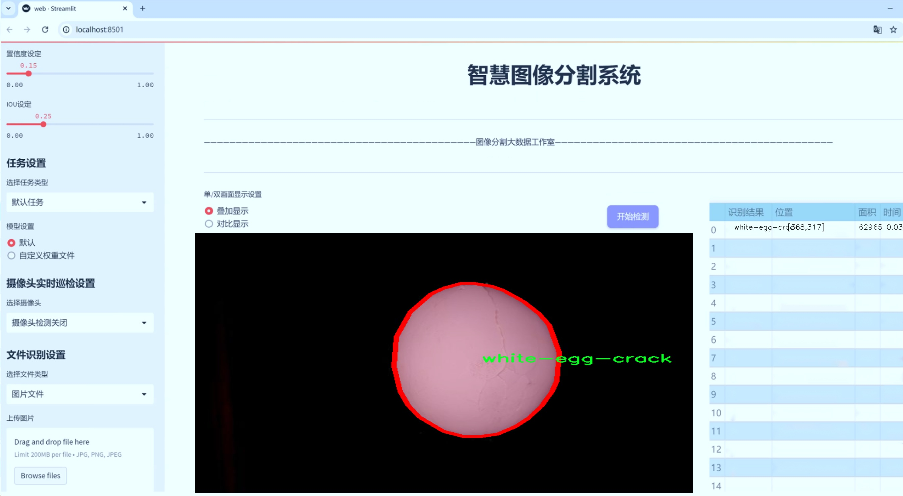
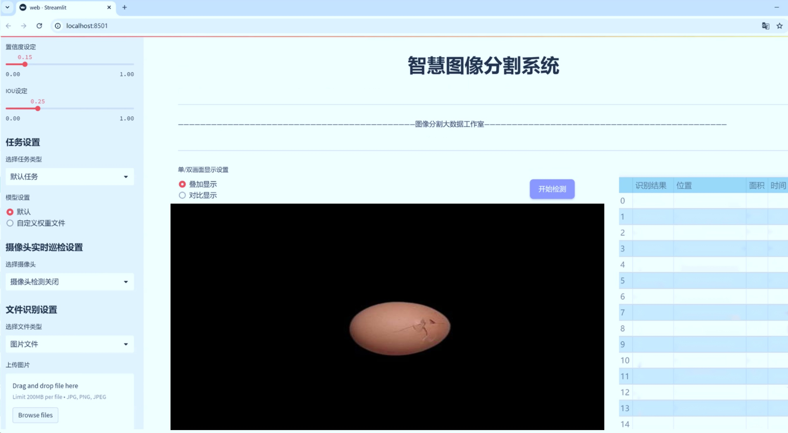
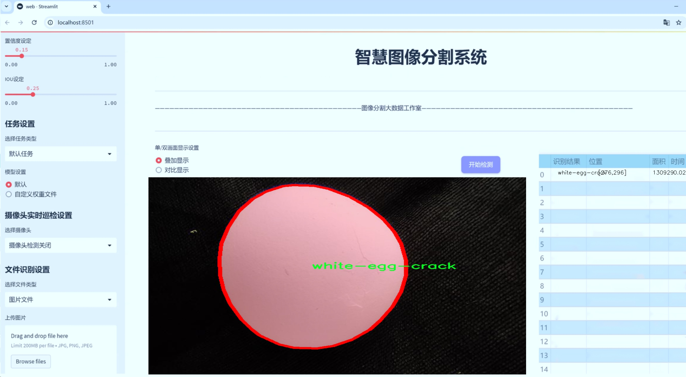
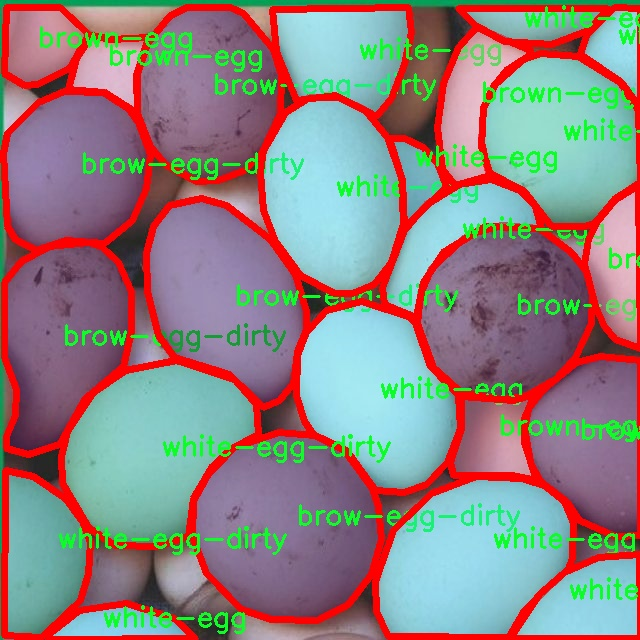
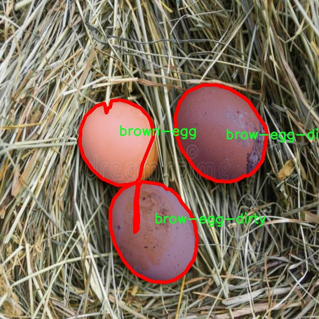
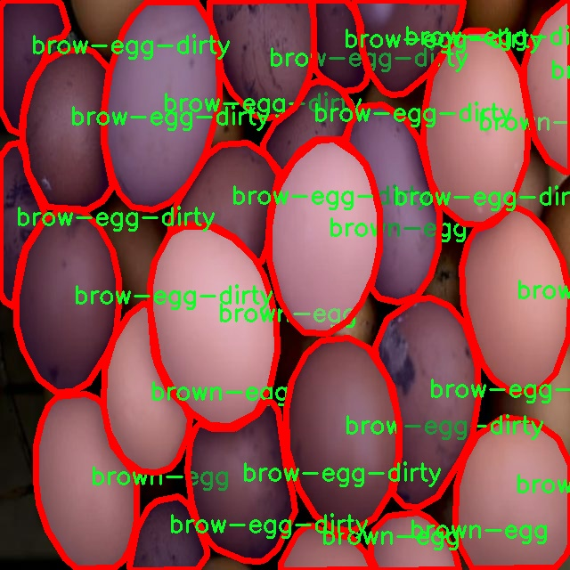
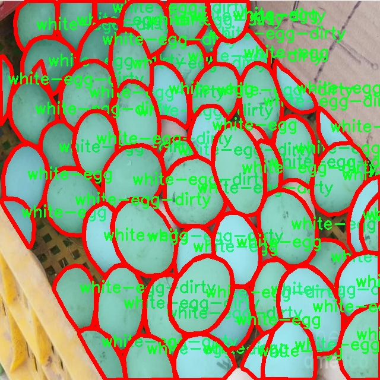

# 鸡蛋裂纹分割系统源码＆数据集分享
 [yolov8-seg-C2f-DLKA＆yolov8-seg-HGNetV2等50+全套改进创新点发刊_一键训练教程_Web前端展示]

### 1.研究背景与意义

项目参考[ILSVRC ImageNet Large Scale Visual Recognition Challenge](https://gitee.com/YOLOv8_YOLOv11_Segmentation_Studio/projects)

项目来源[AAAI Global Al lnnovation Contest](https://kdocs.cn/l/cszuIiCKVNis)

研究背景与意义

随着农业现代化的不断推进，鸡蛋作为一种重要的食品，其质量安全问题日益受到关注。鸡蛋裂纹不仅影响其外观和市场价值，更可能导致细菌污染，进而影响消费者的健康。因此，及时、准确地检测和分割鸡蛋裂纹，对于提高鸡蛋的质量控制水平，保障食品安全具有重要的现实意义。传统的鸡蛋裂纹检测方法多依赖人工检查，效率低下且容易受到主观因素的影响，难以满足现代化生产的需求。因此，基于计算机视觉和深度学习技术的自动化检测系统应运而生，成为解决这一问题的有效途径。

在众多深度学习模型中，YOLO（You Only Look Once）系列因其高效的实时目标检测能力而受到广泛关注。YOLOv8作为该系列的最新版本，结合了更为先进的网络结构和算法优化，能够在保持高精度的同时实现更快的检测速度。然而，针对鸡蛋裂纹这一特定任务，YOLOv8的标准模型仍存在一定的局限性。裂纹的形态多样、尺寸不一且背景复杂，使得裂纹的检测和分割任务具有较高的挑战性。因此，基于改进YOLOv8的鸡蛋裂纹分割系统的研究，具有重要的理论价值和应用前景。

本研究所使用的数据集“crackedChickenEggs”包含4900张鸡蛋图像，涵盖了六个类别，包括不同状态的棕色和白色鸡蛋。这一丰富的数据集为模型的训练和验证提供了坚实的基础。通过对不同类别的细致划分，研究者能够深入分析不同类型裂纹的特征，从而为模型的改进提供数据支持。特别是在实例分割任务中，模型不仅需要识别出裂纹的存在，还需精确分割出裂纹的具体区域，这对算法的精度和鲁棒性提出了更高的要求。

本研究的意义不仅在于提升鸡蛋裂纹检测的自动化水平，更在于推动计算机视觉技术在农业领域的应用。通过改进YOLOv8模型，研究者可以探索更为高效的裂纹检测算法，为其他类似的农产品质量检测提供借鉴。同时，该系统的成功应用将为农业生产者提供科学的决策依据，降低因裂纹导致的经济损失，提升产品的市场竞争力。此外，基于深度学习的裂纹检测技术的推广，能够为食品安全监管提供新的技术手段，促进食品行业的可持续发展。

综上所述，基于改进YOLOv8的鸡蛋裂纹分割系统的研究，不仅具有重要的学术价值，更为实际应用提供了可行的解决方案。随着技术的不断进步和数据集的不断丰富，未来该研究有望在更广泛的领域内发挥重要作用，为农业现代化和食品安全的保障贡献力量。

### 2.图片演示







##### 注意：由于此博客编辑较早，上面“2.图片演示”和“3.视频演示”展示的系统图片或者视频可能为老版本，新版本在老版本的基础上升级如下：（实际效果以升级的新版本为准）

  （1）适配了YOLOV8的“目标检测”模型和“实例分割”模型，通过加载相应的权重（.pt）文件即可自适应加载模型。

  （2）支持“图片识别”、“视频识别”、“摄像头实时识别”三种识别模式。

  （3）支持“图片识别”、“视频识别”、“摄像头实时识别”三种识别结果保存导出，解决手动导出（容易卡顿出现爆内存）存在的问题，识别完自动保存结果并导出到tempDir中。

  （4）支持Web前端系统中的标题、背景图等自定义修改，后面提供修改教程。

  另外本项目提供训练的数据集和训练教程,暂不提供权重文件（best.pt）,需要您按照教程进行训练后实现图片演示和Web前端界面演示的效果。

### 3.视频演示

[3.1 视频演示](https://www.bilibili.com/video/BV1cQyKYBENi/)

### 4.数据集信息展示

##### 4.1 本项目数据集详细数据（类别数＆类别名）

nc: 6
names: ['brow-egg-dirty', 'brown-egg', 'brown-egg-crack', 'white-egg', 'white-egg-crack', 'white-egg-dirty']


##### 4.2 本项目数据集信息介绍

数据集信息展示

在本研究中，我们使用了名为“crackedChickenEggs”的数据集，以训练和改进YOLOv8-seg模型，旨在实现高效的鸡蛋裂纹分割系统。该数据集专门针对鸡蛋的不同状态进行了精心标注，涵盖了六个主要类别，分别为：brow-egg-dirty、brown-egg、brown-egg-crack、white-egg、white-egg-crack和white-egg-dirty。这些类别的选择不仅反映了鸡蛋的颜色和状态差异，还为模型的训练提供了丰富的样本，确保了分割系统在实际应用中的有效性和准确性。

数据集中包含的“brow-egg-dirty”类别，主要指的是表面有污垢的棕色鸡蛋，这类样本的引入使得模型能够学习如何处理不完美的视觉信息，提升了其在复杂环境下的鲁棒性。与之相对的“brown-egg”类别则代表了完好无损的棕色鸡蛋，这为模型提供了理想状态下的参考样本，有助于模型理解和识别鸡蛋的基本特征。

“brown-egg-crack”类别则是我们研究的重点之一，专门标注了带有裂纹的棕色鸡蛋。这一类别的样本不仅帮助模型学习如何识别裂纹的形状和位置，还能让模型理解裂纹对鸡蛋整体外观的影响，从而提高分割的精确度。类似地，“white-egg”类别包含了完好的白色鸡蛋，而“white-egg-crack”则是带有裂纹的白色鸡蛋。这两个类别的设置使得模型能够在不同颜色和状态的鸡蛋之间进行有效区分，进一步增强了其适应性。

最后，“white-egg-dirty”类别同样重要，它代表了表面有污垢的白色鸡蛋。通过引入这一类别，数据集不仅涵盖了鸡蛋的多样性，还考虑到了实际生产和运输过程中可能遇到的各种情况。这种全面的样本选择确保了模型在处理不同类型鸡蛋时的准确性和稳定性。

综上所述，“crackedChickenEggs”数据集的设计充分考虑了鸡蛋的多样性和实际应用场景，涵盖了六个类别，使得YOLOv8-seg模型在训练过程中能够获得丰富的视觉信息和特征学习。这一数据集的应用，不仅有助于提高鸡蛋裂纹分割系统的性能，还为未来相关研究提供了宝贵的基础数据支持。通过对不同类别的深入分析和训练，我们期望能够实现更加精准的裂纹检测和分割，为鸡蛋质量监控和生产管理提供有效的技术支持。










### 5.全套项目环境部署视频教程（零基础手把手教学）

[5.1 环境部署教程链接（零基础手把手教学）](https://www.bilibili.com/video/BV1jG4Ve4E9t/?vd_source=bc9aec86d164b67a7004b996143742dc)


[5.2 安装Python虚拟环境创建和依赖库安装视频教程链接（零基础手把手教学）](https://www.bilibili.com/video/BV1nA4VeYEze/?vd_source=bc9aec86d164b67a7004b996143742dc)

### 6.手把手YOLOV8-seg训练视频教程（零基础小白有手就能学会）

[6.1 手把手YOLOV8-seg训练视频教程（零基础小白有手就能学会）](https://www.bilibili.com/video/BV1cA4VeYETe/?vd_source=bc9aec86d164b67a7004b996143742dc)


按照上面的训练视频教程链接加载项目提供的数据集，运行train.py即可开始训练



     Epoch   gpu_mem       box       obj       cls    labels  img_size
     1/200     0G   0.01576   0.01955  0.007536        22      1280: 100%|██████████| 849/849 [14:42<00:00,  1.04s/it]
               Class     Images     Labels          P          R     mAP@.5 mAP@.5:.95: 100%|██████████| 213/213 [01:14<00:00,  2.87it/s]
                 all       3395      17314      0.994      0.957      0.0957      0.0843

     Epoch   gpu_mem       box       obj       cls    labels  img_size
     2/200     0G   0.01578   0.01923  0.007006        22      1280: 100%|██████████| 849/849 [14:44<00:00,  1.04s/it]
               Class     Images     Labels          P          R     mAP@.5 mAP@.5:.95: 100%|██████████| 213/213 [01:12<00:00,  2.95it/s]
                 all       3395      17314      0.996      0.956      0.0957      0.0845

     Epoch   gpu_mem       box       obj       cls    labels  img_size
     3/200     0G   0.01561    0.0191  0.006895        27      1280: 100%|██████████| 849/849 [10:56<00:00,  1.29it/s]
               Class     Images     Labels          P          R     mAP@.5 mAP@.5:.95: 100%|███████   | 187/213 [00:52<00:00,  4.04it/s]
                 all       3395      17314      0.996      0.957      0.0957      0.0845


### 7.50+种全套YOLOV8-seg创新点代码加载调参视频教程（一键加载写好的改进模型的配置文件）

[7.1 50+种全套YOLOV8-seg创新点代码加载调参视频教程（一键加载写好的改进模型的配置文件）](https://www.bilibili.com/video/BV1Hw4VePEXv/?vd_source=bc9aec86d164b67a7004b996143742dc)

### 8.YOLOV8-seg图像分割算法原理

原始YOLOv8-seg算法原理

YOLOv8-seg算法是YOLO系列目标检测模型的最新版本，旨在实现高效的目标检测与实例分割任务。该算法的设计不仅继承了前几代YOLO模型的优点，还在多个方面进行了创新和优化，使其在精度和速度上都达到了新的高度。YOLOv8-seg的核心架构由输入层、主干网络、颈部网络和头部网络等主要组件构成，每个部分都经过精心设计，以确保模型的高效性和准确性。

在输入层，YOLOv8-seg首先对输入图像进行缩放，以满足指定的输入尺寸需求。这一过程确保了模型能够处理不同大小的图像，并为后续的特征提取奠定基础。接下来，主干网络通过一系列卷积操作对图像进行下采样，提取出丰富的特征信息。每个卷积层都包含批归一化和SiLUR激活函数，这种设计不仅加速了模型的收敛速度，还提高了特征的表达能力。

主干网络的一个重要创新是引入了C2f模块，这一模块借鉴了YOLOv7中的E-ELAN结构，通过跨层分支连接来增强模型的梯度流。C2f模块的设计使得信息能够在不同层之间高效流动，从而改善了特征的提取效果和检测结果。主干网络的末尾，SPPFl块通过三个最大池化层处理多尺度特征，进一步增强了网络的特征抽象能力，使得模型能够更好地应对不同尺寸的目标。

在颈部网络中，YOLOv8-seg采用了FPNS（特征金字塔网络）和PAN（路径聚合网络）结构，这一设计旨在融合不同尺度特征图的信息，并将其有效传递给头部网络。FPNS通过自上而下的特征融合，能够在不同层次上捕捉到丰富的上下文信息，而PAN则通过自下而上的特征聚合，增强了对细节特征的提取能力。这种多尺度特征融合的策略，使得YOLOv8-seg在处理复杂场景时，能够更好地识别和分割目标。

最后，YOLOv8-seg采用了解耦的检测头，这一设计使得模型在进行目标检测时，能够分别计算回归和类别的损失。解耦头的引入，不仅简化了模型的结构，还提高了检测的准确性。通过两个并行的卷积分支，YOLOv8-seg能够在不依赖锚框的情况下，灵活地处理不同类别的目标，从而提升了模型的适应性和鲁棒性。

YOLOv8-seg的另一个显著特点是其轻量化设计。为了满足实时应用的需求，YOLOv8-seg在骨干特征提取网络层使用了更轻量化的C2F模块，并减少了降采样层的数量。这一优化使得模型在保持高精度的同时，显著降低了计算复杂度和内存占用。此外，YOLOv8-seg还引入了BiFPN网络，以提高对不同尺度特征信息的提取速度。这一双向跨尺度连接的设计，使得模型能够更高效地融合特征，从而在多种应用场景中表现出色。

总的来说，YOLOv8-seg算法通过一系列创新的设计和优化，极大地提升了目标检测与实例分割的性能。其主干网络、颈部网络和头部网络的高效组合，使得YOLOv8-seg能够在各种硬件平台上实现快速而准确的目标检测。这一算法不仅在精度和执行时间上超越了现有的模型，还为未来的计算机视觉研究提供了新的思路和方向。随着YOLOv8-seg的广泛应用，我们有理由相信，它将在自动驾驶、智能监控、医疗影像等领域发挥重要作用，推动相关技术的进一步发展。


### 9.系统功能展示（检测对象为举例，实际内容以本项目数据集为准）

图9.1.系统支持检测结果表格显示

  图9.2.系统支持置信度和IOU阈值手动调节

  图9.3.系统支持自定义加载权重文件best.pt(需要你通过步骤5中训练获得)

  图9.4.系统支持摄像头实时识别

  图9.5.系统支持图片识别

  图9.6.系统支持视频识别

  图9.7.系统支持识别结果文件自动保存

  图9.8.系统支持Excel导出检测结果数据


### 10.50+种全套YOLOV8-seg创新点原理讲解（非科班也可以轻松写刊发刊，V11版本正在科研待更新）

#### 10.1 由于篇幅限制，每个创新点的具体原理讲解就不一一展开，具体见下列网址中的创新点对应子项目的技术原理博客网址【Blog】：


[10.1 50+种全套YOLOV8-seg创新点原理讲解链接](https://gitee.com/qunmasj/good)

#### 10.2 部分改进模块原理讲解(完整的改进原理见上图和技术博客链接)【如果此小节的图加载失败可以通过CSDN或者Github搜索该博客的标题访问原始博客，原始博客图片显示正常】
### YOLOv8简介
#### Neck模块设计
骨干网络和 Neck 的具体变化为：

第一个卷积层的 kernel 从 6x6 变成了 3x3
所有的 C3 模块换成 C2f，结构如下所示，可以发现多了更多的跳层连接和额外的 Split 操作


去掉了 Neck 模块中的 2 个卷积连接层
Backbone 中 C2f 的 block 数从 3-6-9-3 改成了 3-6-6-3
查看 N/S/M/L/X 等不同大小模型，可以发现 N/S 和 L/X 两组模型只是改了缩放系数，但是 S/M/L 等骨干网络的通道数设置不一样，没有遵循同一套缩放系数。如此设计的原因应该是同一套缩放系数下的通道设置不是最优设计，YOLOv7 网络设计时也没有遵循一套缩放系数作用于所有模型。

#### Head模块设计
Head 部分变化最大，从原先的耦合头变成了解耦头，并且从 YOLOv5 的 Anchor-Based 变成了 Anchor-Free。其结构如下所示：


可以看出，不再有之前的 objectness 分支，只有解耦的分类和回归分支，并且其回归分支使用了 Distribution Focal Loss 中提出的积分形式表示法。

#### Loss 计算
Loss 计算过程包括 2 个部分： 正负样本分配策略和 Loss 计算。 现代目标检测器大部分都会在正负样本分配策略上面做文章，典型的如 YOLOX 的 simOTA、TOOD 的 TaskAlignedAssigner 和 RTMDet 的 DynamicSoftLabelAssigner，这类 Assigner 大都是动态分配策略，而 YOLOv5 采用的依然是静态分配策略。考虑到动态分配策略的优异性，YOLOv8 算法中则直接引用了 TOOD 的 TaskAlignedAssigner。 TaskAlignedAssigner 的匹配策略简单总结为： 根据分类与回归的分数加权的分数选择正样本。

s 是标注类别对应的预测分值，u 是预测框和 gt 框的 iou，两者相乘就可以衡量对齐程度。

对于每一个 GT，对所有的预测框基于 GT 类别对应分类分数，预测框与 GT 的 IoU 的加权得到一个关联分类以及回归的对齐分数 alignment_metrics 。
对于每一个 GT，直接基于 alignment_metrics 对齐分数选取 topK 大的作为正样本
Loss 计算包括 2 个分支： 分类和回归分支，没有了之前的 objectness 分支。
分类分支依然采用 BCE Loss
回归分支需要和 Distribution Focal Loss 中提出的积分形式表示法绑定，因此使用了 Distribution Focal Loss， 同时还使用了 CIoU Loss
Loss 采用一定权重比例加权即可。
#### 训练数据增强
数据增强方面和 YOLOv5 差距不大，只不过引入了 YOLOX 中提出的最后 10 个 epoch 关闭 Mosaic 的操作。假设训练 epoch 是 500，其示意图如下所示：

### RCS-OSA的基本原理
参考该博客，RCSOSA（RCS-One-Shot Aggregation）是RCS-YOLO中提出的一种结构，我们可以将主要原理概括如下：

1. RCS（Reparameterized Convolution based on channel Shuffle）: 结合了通道混洗，通过重参数化卷积来增强网络的特征提取能力。

2. RCS模块: 在训练阶段，利用多分支结构学习丰富的特征表示；在推理阶段，通过结构化重参数化简化为单一分支，减少内存消耗。

3. OSA（One-Shot Aggregation）: 一次性聚合多个特征级联，减少网络计算负担，提高计算效率。

4. 特征级联: RCS-OSA模块通过堆叠RCS，确保特征的复用并加强不同层之间的信息流动。

#### RCS
RCS（基于通道Shuffle的重参数化卷积）是RCS-YOLO的核心组成部分，旨在训练阶段通过多分支结构学习丰富的特征信息，并在推理阶段通过简化为单分支结构来减少内存消耗，实现快速推理。此外，RCS利用通道分割和通道Shuffle操作来降低计算复杂性，同时保持通道间的信息交换，这样在推理阶段相比普通的3×3卷积可以减少一半的计算复杂度。通过结构重参数化，RCS能够在训练阶段从输入特征中学习深层表示，并在推理阶段实现快速推理，同时减少内存消耗。

#### RCS模块
RCS（基于通道Shuffle的重参数化卷积）模块中，结构在训练阶段使用多个分支，包括1x1和3x3的卷积，以及一个直接的连接（Identity），用于学习丰富的特征表示。在推理阶段，结构被重参数化成一个单一的3x3卷积，以减少计算复杂性和内存消耗，同时保持训练阶段学到的特征表达能力。这与RCS的设计理念紧密相连，即在不牺牲性能的情况下提高计算效率。


上图为大家展示了RCS的结构，分为训练阶段（a部分）和推理阶段（b部分）。在训练阶段，输入通过通道分割，一部分输入经过RepVGG块，另一部分保持不变。然后通过1x1卷积和3x3卷积处理RepVGG块的输出，与另一部分输入进行通道Shuffle和连接。在推理阶段，原来的多分支结构被简化为一个单一的3x3 RepConv块。这种设计允许在训练时学习复杂特征，在推理时减少计算复杂度。黑色边框的矩形代表特定的模块操作，渐变色的矩形代表张量的特定特征，矩形的宽度代表张量的通道数。 

#### OSA
OSA（One-Shot Aggregation）是一个关键的模块，旨在提高网络在处理密集连接时的效率。OSA模块通过表示具有多个感受野的多样化特征，并在最后的特征映射中仅聚合一次所有特征，从而克服了DenseNet中密集连接的低效率问题。

OSA模块的使用有两个主要目的：

1. 提高特征表示的多样性：OSA通过聚合具有不同感受野的特征来增加网络对于不同尺度的敏感性，这有助于提升模型对不同大小目标的检测能力。

2. 提高效率：通过在网络的最后一部分只进行一次特征聚合，OSA减少了重复的特征计算和存储需求，从而提高了网络的计算和能源效率。

在RCS-YOLO中，OSA模块被进一步与RCS（基于通道Shuffle的重参数化卷积）相结合，形成RCS-OSA模块。这种结合不仅保持了低成本的内存消耗，而且还实现了语义信息的有效提取，对于构建轻量级和大规模的对象检测器尤为重要。

下面我将为大家展示RCS-OSA（One-Shot Aggregation of RCS）的结构。


在RCS-OSA模块中，输入被分为两部分，一部分直接通过，另一部分通过堆叠的RCS模块进行处理。处理后的特征和直接通过的特征在通道混洗（Channel Shuffle）后合并。这种结构设计用于增强模型的特征提取和利用效率，是RCS-YOLO架构中的一个关键组成部分旨在通过一次性聚合来提高模型处理特征的能力，同时保持计算效率。

#### 特征级联
特征级联（feature cascade）是一种技术，通过在网络的一次性聚合（one-shot aggregate）路径上维持有限数量的特征级联来实现的。在RCS-YOLO中，特别是在RCS-OSA（RCS-Based One-Shot Aggregation）模块中，只保留了三个特征级联。

特征级联的目的是为了减轻网络计算负担并降低内存占用。这种方法可以有效地聚合不同层次的特征，提高模型的语义信息提取能力，同时避免了过度复杂化网络结构所带来的低效率和高资源消耗。

下面为大家提供的图像展示的是RCS-YOLO的整体架构，其中包括RCS-OSA模块。RCS-OSA在模型中用于堆叠RCS模块，以确保特征的复用并加强不同层之间的信息流动。图中显示的多层RCS-OSA模块的排列和组合反映了它们如何一起工作以优化特征传递和提高检测性能。


总结：RCS-YOLO主要由RCS-OSA（蓝色模块）和RepVGG（橙色模块）构成。这里的n代表堆叠RCS模块的数量。n_cls代表检测到的对象中的类别数量。图中的IDetect是从YOLOv7中借鉴过来的，表示使用二维卷积神经网络的检测层。这个架构通过堆叠的RCS模块和RepVGG模块，以及两种类型的检测层，实现了对象检测的任务。 


### 11.项目核心源码讲解（再也不用担心看不懂代码逻辑）

#### 11.1 ultralytics\models\utils\__init__.py


该文件是Ultralytics YOLO项目的一部分，文件路径为`ultralytics/models/utils/__init__.py`。从文件名和路径可以推测，这个文件主要用于初始化`utils`模块。文件开头的注释表明该项目是Ultralytics开发的YOLO（You Only Look Once）系列模型，并且使用的是AGPL-3.0许可证，这意味着该代码是开源的，并且在某些条件下允许自由使用和修改。

虽然文件中没有具体的代码实现，但通常在`__init__.py`文件中，开发者会定义模块的公共接口，导入其他子模块或类，以便用户在导入`utils`模块时能够方便地访问所需的功能。这种做法有助于提高代码的可读性和可维护性。

在Ultralytics YOLO项目中，`utils`模块可能包含一些辅助函数或工具类，这些工具可能用于数据处理、模型评估、可视化等方面。通过将这些功能集中在一个模块中，开发者可以更好地组织代码，使得项目结构更加清晰。

总的来说，虽然这个文件本身没有具体的实现代码，但它在整个项目中扮演着重要的角色，帮助用户更方便地使用和理解Ultralytics YOLO的工具功能。

#### 11.1 ui.py

```python
import sys
import subprocess

def run_script(script_path):
    """
    使用当前 Python 环境运行指定的脚本。

    Args:
        script_path (str): 要运行的脚本路径

    Returns:
        None
    """
    # 获取当前 Python 解释器的路径
    python_path = sys.executable

    # 构建运行命令，使用 streamlit 运行指定的脚本
    command = f'"{python_path}" -m streamlit run "{script_path}"'

    # 执行命令
    result = subprocess.run(command, shell=True)
    # 检查命令执行结果，如果返回码不为0，表示执行出错
    if result.returncode != 0:
        print("脚本运行出错。")

# 实例化并运行应用
if __name__ == "__main__":
    # 指定要运行的脚本路径
    script_path = "web.py"  # 这里可以直接指定脚本名

    # 运行脚本
    run_script(script_path)
```

### 代码核心部分注释：
1. **导入模块**：
   - `sys`：用于访问与 Python 解释器紧密相关的变量和函数。
   - `subprocess`：用于创建新进程、连接到它们的输入/输出/错误管道，并获得返回码。

2. **`run_script` 函数**：
   - 该函数接收一个脚本路径作为参数，并在当前 Python 环境中运行该脚本。
   - 使用 `sys.executable` 获取当前 Python 解释器的路径，以确保使用正确的 Python 环境。
   - 构建一个命令字符串，使用 `streamlit` 模块运行指定的脚本。
   - 使用 `subprocess.run` 执行命令，并检查返回码以判断脚本是否成功运行。

3. **主程序块**：
   - 当脚本作为主程序运行时，指定要运行的脚本路径（这里为 `web.py`）。
   - 调用 `run_script` 函数来执行指定的脚本。

这个程序文件的主要功能是通过当前的 Python 环境来运行一个指定的脚本，具体是一个名为 `web.py` 的文件。程序首先导入了必要的模块，包括 `sys`、`os` 和 `subprocess`，以及一个自定义的路径处理模块 `abs_path`。

在 `run_script` 函数中，首先获取当前 Python 解释器的路径，这样可以确保使用正确的 Python 环境来执行脚本。接着，构建一个命令字符串，该命令将使用 `streamlit` 来运行指定的脚本。`streamlit` 是一个用于构建数据应用的框架，通常用于快速创建可视化应用。

随后，使用 `subprocess.run` 方法来执行构建好的命令。这个方法会在一个新的 shell 中运行命令，并等待其完成。如果命令执行的返回码不为零，表示脚本运行过程中出现了错误，程序会输出一条错误信息。

在文件的最后部分，使用 `if __name__ == "__main__":` 语句来确保只有在直接运行该文件时才会执行后面的代码。这里指定了要运行的脚本路径为 `web.py`，并调用 `run_script` 函数来执行这个脚本。

总体来说，这个程序的作用是简化在特定 Python 环境中运行 `web.py` 脚本的过程，并提供了错误处理机制，以便在脚本运行失败时给出提示。

#### 11.2 web.py

以下是代码中最核心的部分，并附上详细的中文注释：

```python
import cv2
import numpy as np
from PIL import ImageFont, ImageDraw, Image
from hashlib import md5

def calculate_polygon_area(points):
    """
    计算多边形的面积，输入应为一个 Nx2 的numpy数组，表示多边形的顶点坐标
    """
    if len(points) < 3:  # 多边形至少需要3个顶点
        return 0
    return cv2.contourArea(points)

def draw_with_chinese(image, text, position, font_size=20, color=(255, 0, 0)):
    """
    在OpenCV图像上绘制中文文字
    """
    # 将图像从 OpenCV 格式（BGR）转换为 PIL 格式（RGB）
    image_pil = Image.fromarray(cv2.cvtColor(image, cv2.COLOR_BGR2RGB))
    draw = ImageDraw.Draw(image_pil)
    # 使用指定的字体
    font = ImageFont.truetype("simsun.ttc", font_size, encoding="unic")
    draw.text(position, text, font=font, fill=color)
    # 将图像从 PIL 格式（RGB）转换回 OpenCV 格式（BGR）
    return cv2.cvtColor(np.array(image_pil), cv2.COLOR_RGB2BGR)

def generate_color_based_on_name(name):
    """
    使用哈希函数生成稳定的颜色
    """
    hash_object = md5(name.encode())
    hex_color = hash_object.hexdigest()[:6]  # 取前6位16进制数
    r, g, b = int(hex_color[0:2], 16), int(hex_color[2:4], 16), int(hex_color[4:6], 16)
    return (b, g, r)  # OpenCV 使用BGR格式

def draw_detections(image, info, alpha=0.2):
    """
    在图像上绘制检测结果，包括边界框和标签
    """
    name, bbox, conf, cls_id, mask = info['class_name'], info['bbox'], info['score'], info['class_id'], info['mask']
    x1, y1, x2, y2 = bbox
    # 绘制边界框
    cv2.rectangle(image, (x1, y1), (x2, y2), color=(0, 0, 255), thickness=3)
    # 绘制类别名称
    image = draw_with_chinese(image, name, (x1, y1 - 10), font_size=20)
    return image

def frame_process(image, model, conf_threshold=0.15, iou_threshold=0.5):
    """
    处理并预测单个图像帧的内容。
    Args:
        image (numpy.ndarray): 输入的图像。
        model: 预训练的模型。
        conf_threshold (float): 置信度阈值。
        iou_threshold (float): IOU阈值。
    Returns:
        tuple: 处理后的图像，检测信息。
    """
    pre_img = model.preprocess(image)  # 对图像进行预处理
    params = {'conf': conf_threshold, 'iou': iou_threshold}
    model.set_param(params)  # 更新模型参数
    pred = model.predict(pre_img)  # 使用模型进行预测

    detInfo = []  # 存储检测信息
    if pred is not None and len(pred):
        for info in pred:  # 遍历检测到的对象
            image = draw_detections(image, info)  # 绘制检测结果
            detInfo.append(info)  # 添加检测信息
    return image, detInfo

# 示例使用
if __name__ == "__main__":
    # 加载模型和图像
    model = ...  # 这里应加载你的模型
    image = cv2.imread('path_to_image.jpg')  # 读取图像
    processed_image, detections = frame_process(image, model)  # 处理图像
    cv2.imshow('Detections', processed_image)  # 显示结果
    cv2.waitKey(0)
    cv2.destroyAllWindows()
```

### 代码说明：
1. **计算多边形面积**：`calculate_polygon_area` 函数用于计算多边形的面积，确保输入至少有三个顶点。
2. **绘制中文文本**：`draw_with_chinese` 函数使用PIL库在OpenCV图像上绘制中文文本，支持自定义字体和颜色。
3. **生成颜色**：`generate_color_based_on_name` 函数通过哈希函数为每个类别生成稳定的颜色，以便在绘制时使用。
4. **绘制检测结果**：`draw_detections` 函数在图像上绘制检测框和类别名称。
5. **处理图像帧**：`frame_process` 函数对输入图像进行预处理、模型预测，并绘制检测结果，返回处理后的图像和检测信息。

这些核心部分构成了图像检测的基础功能，能够处理图像并在其上绘制检测结果。

这个程序文件`web.py`是一个基于Streamlit的图像分割和目标检测应用，主要用于实时处理视频流或上传的图像/视频文件，识别并标记其中的目标。以下是对代码的详细讲解。

首先，程序导入了一系列必要的库，包括`random`、`tempfile`、`time`、`os`、`cv2`（OpenCV）、`numpy`、`streamlit`等。这些库提供了随机数生成、临时文件处理、图像处理、数组操作和Web应用开发等功能。

接下来，定义了一些辅助函数。`calculate_polygon_area`用于计算多边形的面积，`draw_with_chinese`用于在图像上绘制中文文本，`generate_color_based_on_name`根据目标名称生成稳定的颜色，`adjust_parameter`用于根据图像大小调整参数，`draw_detections`则负责在图像上绘制检测结果，包括目标的边界框、类别名称和其他信息。

`Detection_UI`类是整个应用的核心，负责初始化和管理用户界面及检测逻辑。在初始化方法中，设置了一些默认参数，包括模型类型、置信度阈值、IOU阈值、摄像头选择、文件上传等。类中还包含了一些用于管理UI布局和交互的函数，如`setup_page`和`setup_sidebar`，这些函数设置了页面标题、侧边栏选项以及文件上传器。

在`process_camera_or_file`方法中，程序根据用户选择的输入源（摄像头或文件）进行处理。如果选择了摄像头，程序会使用OpenCV捕获视频流，并在每一帧上进行目标检测；如果选择了上传的文件，则读取文件并进行处理。检测结果会被实时更新到UI中，并且可以保存为图像或视频文件。

`frame_process`方法是处理每一帧图像的核心，负责对输入图像进行预处理、调用模型进行预测，并将结果绘制到图像上。检测信息会被记录到日志表中，便于后续查看和导出。

程序的最后部分是主函数，实例化`Detection_UI`类并运行应用。用户可以通过Web界面上传图像或视频，选择摄像头进行实时检测，并查看检测结果。

总的来说，这个程序结合了图像处理、深度学习模型推理和Web应用开发，提供了一个完整的目标检测解决方案，适用于需要实时图像分析的场景。

#### 11.3 ultralytics\models\yolo\segment\val.py

以下是经过简化并注释的核心代码部分，主要保留了`SegmentationValidator`类的关键功能和逻辑：

```python
import numpy as np
import torch
import torch.nn.functional as F
from ultralytics.utils import ops

class SegmentationValidator:
    """
    用于基于分割模型的验证的类，继承自DetectionValidator。
    """

    def __init__(self, dataloader=None, save_dir=None, args=None):
        """初始化SegmentationValidator，设置任务为'segment'，并初始化指标。"""
        self.dataloader = dataloader  # 数据加载器
        self.save_dir = save_dir  # 保存目录
        self.args = args  # 参数
        self.metrics = SegmentMetrics(save_dir=self.save_dir)  # 初始化指标
        self.plot_masks = []  # 用于存储绘图的掩码
        self.device = 'cuda' if torch.cuda.is_available() else 'cpu'  # 选择设备

    def preprocess(self, batch):
        """预处理批次，将掩码转换为浮点数并发送到设备。"""
        batch['masks'] = batch['masks'].to(self.device).float()  # 将掩码转换为浮点数并移动到设备
        return batch

    def postprocess(self, preds):
        """后处理YOLO预测，返回输出检测结果和原型。"""
        # 应用非极大值抑制（NMS）来过滤重叠的预测框
        p = ops.non_max_suppression(preds[0], self.args.conf, self.args.iou)
        proto = preds[1][-1] if len(preds[1]) == 3 else preds[1]  # 获取原型
        return p, proto

    def update_metrics(self, preds, batch):
        """更新指标。"""
        for si, (pred, proto) in enumerate(zip(preds[0], preds[1])):
            idx = batch['batch_idx'] == si  # 当前批次索引
            cls = batch['cls'][idx]  # 获取类别
            bbox = batch['bboxes'][idx]  # 获取边界框
            npr = pred.shape[0]  # 预测数量
            shape = batch['ori_shape'][si]  # 原始形状
            correct_masks = torch.zeros(npr, dtype=torch.bool, device=self.device)  # 初始化正确掩码
            self.seen += 1  # 记录已处理的样本数量

            if npr == 0:  # 如果没有预测
                continue

            # 处理掩码
            gt_masks = batch['masks'][idx]  # 获取真实掩码
            pred_masks = self.process(proto, pred[:, 6:], pred[:, :4], shape=batch['img'][si].shape[1:])  # 处理预测掩码

            # 评估
            if cls.shape[0]:  # 如果有真实类别
                correct_masks = self._process_batch(pred, cls, pred_masks, gt_masks)  # 处理预测和真实掩码

            # 更新统计信息
            self.stats.append((correct_masks, pred[:, 4], cls.squeeze(-1)))  # 记录正确掩码和置信度

    def _process_batch(self, detections, labels, pred_masks, gt_masks):
        """
        返回正确预测矩阵。
        Args:
            detections: 预测结果
            labels: 真实标签
            pred_masks: 预测掩码
            gt_masks: 真实掩码
        Returns:
            correct: 正确预测的数组
        """
        iou = mask_iou(gt_masks.view(gt_masks.shape[0], -1), pred_masks.view(pred_masks.shape[0], -1))  # 计算掩码的IoU
        return self.match_predictions(detections[:, 5], labels[:, 0], iou)  # 匹配预测与真实标签

    def plot_predictions(self, batch, preds, ni):
        """绘制批次预测的掩码和边界框。"""
        plot_images(batch['img'], preds, paths=batch['im_file'], fname=self.save_dir / f'val_batch{ni}_pred.jpg')
```

### 代码注释说明：
1. **类初始化**：`__init__`方法中初始化了数据加载器、保存目录、参数和指标，并选择了设备（CPU或GPU）。
2. **预处理**：`preprocess`方法将输入批次中的掩码转换为浮点数并移动到指定设备。
3. **后处理**：`postprocess`方法应用非极大值抑制来过滤重叠的预测框，并返回处理后的预测结果和原型。
4. **更新指标**：`update_metrics`方法计算预测结果与真实标签之间的匹配情况，并更新统计信息。
5. **处理批次**：`_process_batch`方法计算预测掩码与真实掩码之间的IoU，并返回正确预测的数组。
6. **绘制预测**：`plot_predictions`方法用于可视化预测结果，包括掩码和边界框。

以上是代码的核心部分和详细注释，帮助理解分割模型验证的流程和逻辑。


#### 11.3 ultralytics\utils\plotting.py

以下是经过简化和注释的核心代码部分，主要包括 `Colors` 和 `Annotator` 类，以及一些辅助函数。注释详细解释了每个部分的功能和用途。

```python
import numpy as np
import torch
from PIL import Image, ImageDraw, ImageFont

class Colors:
    """
    颜色类，用于处理颜色调色板。
    包含将十六进制颜色代码转换为RGB值的方法。
    """

    def __init__(self):
        """初始化颜色调色板，使用十六进制颜色值。"""
        hexs = ('FF3838', 'FF9D97', 'FF701F', 'FFB21D', 'CFD231', 
                '48F90A', '92CC17', '3DDB86', '1A9334', '00D4BB',
                '2C99A8', '00C2FF', '344593', '6473FF', '0018EC', 
                '8438FF', '520085', 'CB38FF', 'FF95C8', 'FF37C7')
        # 将十六进制颜色转换为RGB格式
        self.palette = [self.hex2rgb(f'#{c}') for c in hexs]
        self.n = len(self.palette)  # 颜色数量

    def __call__(self, i, bgr=False):
        """根据索引返回颜色，支持BGR格式。"""
        c = self.palette[int(i) % self.n]  # 循环使用颜色
        return (c[2], c[1], c[0]) if bgr else c  # 返回BGR或RGB格式

    @staticmethod
    def hex2rgb(h):
        """将十六进制颜色代码转换为RGB值。"""
        return tuple(int(h[1 + i:1 + i + 2], 16) for i in (0, 2, 4))


class Annotator:
    """
    注释类，用于在图像上绘制框、文本和关键点。
    """

    def __init__(self, im, line_width=None, font_size=None, font='Arial.ttf', pil=False):
        """初始化Annotator类，设置图像和绘制参数。"""
        self.im = im if isinstance(im, Image.Image) else Image.fromarray(im)  # 确保图像为PIL格式
        self.draw = ImageDraw.Draw(self.im)  # 创建绘图对象
        self.lw = line_width or 2  # 默认线宽
        self.font = ImageFont.truetype(font, font_size or 12)  # 设置字体

    def box_label(self, box, label='', color=(128, 128, 128), txt_color=(255, 255, 255)):
        """在图像上绘制边框和标签。"""
        self.draw.rectangle(box, width=self.lw, outline=color)  # 绘制边框
        if label:
            w, h = self.font.getsize(label)  # 获取文本宽高
            self.draw.rectangle((box[0], box[1] - h, box[0] + w + 1, box[1] + 1), fill=color)  # 绘制标签背景
            self.draw.text((box[0], box[1] - h), label, fill=txt_color, font=self.font)  # 绘制文本

    def kpts(self, kpts, radius=5):
        """在图像上绘制关键点。"""
        for k in kpts:
            x, y = int(k[0]), int(k[1])
            self.draw.ellipse((x - radius, y - radius, x + radius, y + radius), fill=(255, 0, 0))  # 绘制圆形关键点

    def result(self):
        """返回注释后的图像。"""
        return np.asarray(self.im)  # 将PIL图像转换为numpy数组


def save_one_box(xyxy, im, file='im.jpg', gain=1.02, pad=10, square=False):
    """
    根据边界框保存图像裁剪。
    """
    if not isinstance(xyxy, torch.Tensor):  # 如果不是张量，则转换为张量
        xyxy = torch.tensor(xyxy)
    b = xyxy.view(-1, 4)  # 变形为边界框格式
    if square:
        b[:, 2:] = b[:, 2:].max(1)[0].unsqueeze(1)  # 将矩形转换为正方形
    b[:, 2:] = b[:, 2:] * gain + pad  # 根据增益和填充调整边界框
    crop = im[int(b[0, 1]):int(b[0, 3]), int(b[0, 0]):int(b[0, 2])]  # 裁剪图像
    Image.fromarray(crop).save(file)  # 保存裁剪后的图像
    return crop  # 返回裁剪后的图像
```

### 代码核心部分说明
1. **Colors 类**：用于管理颜色调色板，支持将十六进制颜色转换为RGB格式，并根据索引返回颜色。
2. **Annotator 类**：用于在图像上绘制边框、文本和关键点，支持使用PIL库进行绘图。
3. **save_one_box 函数**：根据给定的边界框从图像中裁剪出区域并保存为文件，支持调整裁剪区域的大小和形状。

通过这些核心部分，可以实现图像的注释和处理功能，适用于目标检测和其他计算机视觉任务。

这个程序文件是Ultralytics YOLO模型中的一个工具模块，主要用于图像的绘制和可视化。文件中包含多个类和函数，帮助用户在训练和推理过程中对图像进行标注、绘制和保存结果。

首先，文件导入了一些必要的库，包括`cv2`、`matplotlib`、`numpy`、`torch`和`PIL`等，这些库提供了图像处理和绘图的功能。接着，定义了一个`Colors`类，用于管理颜色调色板，包括将十六进制颜色代码转换为RGB值的方法。该类的构造函数初始化了一组颜色，并提供了通过索引获取颜色的功能。

接下来，定义了一个`Annotator`类，用于在图像上添加标注。该类支持使用PIL或OpenCV进行绘制，能够绘制边框、文本、关键点和掩膜等。`Annotator`类的构造函数接受图像、线宽、字体等参数，并根据这些参数初始化绘图工具。该类中包含多个方法，如`box_label`用于绘制边框和标签，`masks`用于绘制掩膜，`kpts`用于绘制关键点，`rectangle`和`text`用于绘制矩形和文本。

此外，文件中还定义了一些用于绘制和保存结果的函数。例如，`plot_labels`函数用于绘制训练标签的直方图和箱形图，`save_one_box`函数用于根据给定的边界框裁剪并保存图像，`plot_images`函数用于绘制图像网格并添加标签，`plot_results`函数用于从CSV文件中绘制训练结果。

文件的最后部分包含一些辅助函数，如`plt_color_scatter`用于绘制带有颜色的散点图，`plot_tune_results`用于绘制超参数调优结果，`output_to_target`用于将模型输出转换为目标格式，`feature_visualization`用于可视化模型模块的特征图。

总体而言，这个文件提供了一系列强大的工具，方便用户在YOLO模型的训练和推理过程中进行图像的可视化和结果的分析。

#### 11.4 train.py

以下是代码中最核心的部分，并附上详细的中文注释：

```python
import os
import torch
import yaml
from ultralytics import YOLO  # 导入YOLO模型

if __name__ == '__main__':  # 确保该模块被直接运行时才执行以下代码
    # 设置训练参数
    workers = 1  # 数据加载的工作进程数
    batch = 8  # 每个批次的样本数量，视显存情况调整
    device = "0" if torch.cuda.is_available() else "cpu"  # 检查是否有可用的GPU

    # 获取数据集的YAML配置文件的绝对路径
    data_path = abs_path(f'datasets/data/data.yaml', path_type='current')  

    # 将路径格式转换为Unix风格
    unix_style_path = data_path.replace(os.sep, '/')
    # 获取目录路径
    directory_path = os.path.dirname(unix_style_path)

    # 读取YAML文件，保持原有顺序
    with open(data_path, 'r') as file:
        data = yaml.load(file, Loader=yaml.FullLoader)

    # 修改数据集路径
    if 'train' in data and 'val' in data and 'test' in data:
        data['train'] = directory_path + '/train'  # 设置训练集路径
        data['val'] = directory_path + '/val'      # 设置验证集路径
        data['test'] = directory_path + '/test'    # 设置测试集路径

        # 将修改后的数据写回YAML文件
        with open(data_path, 'w') as file:
            yaml.safe_dump(data, file, sort_keys=False)

    # 加载YOLO模型配置文件和预训练权重
    model = YOLO(r"C:\codeseg\codenew\50+种YOLOv8算法改进源码大全和调试加载训练教程（非必要）\改进YOLOv8模型配置文件\yolov8-seg-C2f-Faster.yaml").load("./weights/yolov8s-seg.pt")

    # 开始训练模型
    results = model.train(
        data=data_path,  # 指定训练数据的配置文件路径
        device=device,  # 指定使用的设备（GPU或CPU）
        workers=workers,  # 指定用于数据加载的工作进程数
        imgsz=640,  # 指定输入图像的大小为640x640
        epochs=100,  # 指定训练的轮数为100
        batch=batch,  # 指定每个批次的样本数量
    )
```

### 代码注释说明：
1. **导入必要的库**：导入`os`、`torch`、`yaml`和YOLO模型相关的库。
2. **设置训练参数**：包括工作进程数、批次大小和设备选择（GPU或CPU）。
3. **获取数据集路径**：通过`abs_path`函数获取数据集配置文件的绝对路径，并转换为Unix风格路径。
4. **读取和修改YAML文件**：读取YAML文件内容，修改训练、验证和测试集的路径，并将修改后的内容写回文件。
5. **加载YOLO模型**：根据指定的配置文件和预训练权重加载YOLO模型。
6. **训练模型**：调用`model.train`方法开始训练，传入数据路径、设备、工作进程数、图像大小、训练轮数和批次大小等参数。

这个程序文件`train.py`的主要功能是使用YOLO（You Only Look Once）模型进行目标检测的训练。程序首先导入了必要的库，包括操作系统相关的`os`、深度学习框架`torch`、YAML文件处理库`yaml`、YOLO模型库`ultralytics`以及用于图形界面的`matplotlib`。

在程序的主入口部分，首先设置了一些训练参数，包括工作进程数`workers`、批次大小`batch`和设备类型`device`。设备类型会根据是否有可用的GPU进行判断，如果有GPU则使用“0”，否则使用“cpu”。

接下来，程序构建了数据集的配置文件路径，使用`abs_path`函数获取该路径的绝对路径。然后，程序将路径中的分隔符统一替换为Unix风格的斜杠，以确保在不同操作系统中路径的兼容性。通过读取指定的YAML文件，程序获取数据集的配置信息，并检查其中是否包含训练、验证和测试数据的路径。如果这些路径存在，程序会将其修改为相对于数据集目录的路径，并将修改后的数据重新写回YAML文件。

程序还提醒用户，不同的YOLO模型对设备的要求不同，如果遇到显存不足的错误，可以尝试使用其他模型进行测试。随后，程序加载了指定的YOLO模型配置文件，并加载了预训练的权重文件。

最后，程序调用`model.train`方法开始训练模型，传入训练数据的配置文件路径、设备类型、工作进程数、输入图像大小、训练的epoch数量和批次大小等参数。这些设置将指导模型在指定的数据集上进行训练，最终生成训练结果。

#### 11.5 ultralytics\nn\extra_modules\dynamic_snake_conv.py


这个程序文件定义了一个动态蛇形卷积（Dynamic Snake Convolution）模块，主要用于深度学习中的卷积操作。它包含两个主要的类：`DySnakeConv` 和 `DSConv`，以及一个辅助类 `DSC`。

`DySnakeConv` 类是一个神经网络模块，继承自 `nn.Module`。在初始化方法中，它接收输入通道数 `inc`、输出通道数 `ouc` 和卷积核大小 `k`。该类创建了三个卷积层：`conv_0` 是标准卷积，`conv_x` 和 `conv_y` 是动态蛇形卷积，分别沿着 x 轴和 y 轴进行卷积。在前向传播方法中，输入 `x` 会通过这三个卷积层处理，并将结果在通道维度上拼接起来。

`DSConv` 类实现了动态蛇形卷积的具体逻辑。它同样继承自 `nn.Module`，在初始化时接收输入通道、输出通道、卷积核大小、形态（morph）和是否需要偏移（if_offset）等参数。该类的构造函数中定义了偏移卷积层 `offset_conv`，用于学习可变形的偏移量，以及两个不同方向的卷积层 `dsc_conv_x` 和 `dsc_conv_y`。在前向传播中，首先通过偏移卷积层计算偏移量，然后使用这些偏移量进行坐标映射和双线性插值，最终得到变形后的特征图。

`DSC` 类是一个辅助类，负责处理坐标映射和双线性插值。它在初始化时接收输入特征图的形状、卷积核大小、扩展范围和形态等参数。`_coordinate_map_3D` 方法根据偏移量生成新的坐标映射，`_bilinear_interpolate_3D` 方法则实现了双线性插值，以根据新的坐标从输入特征图中提取值。`deform_conv` 方法结合这两个步骤，完成了动态蛇形卷积的核心操作。

整体而言，这个文件实现了一种新型的卷积操作，能够根据输入特征图的内容动态调整卷积核的位置，从而提高模型的表达能力和灵活性。

#### 11.5 ultralytics\trackers\utils\__init__.py

以下是对给定代码的核心部分进行保留和详细注释的版本：

```python
# Ultralytics YOLO 🚀, AGPL-3.0 license

# YOLO（You Only Look Once）是一种实时目标检测算法
# Ultralytics 是 YOLO 的一个实现，支持多种功能和优化

# 这里的代码通常会包含模型的定义、训练和推理的过程
# 具体实现可能包括以下几个核心部分：

# 1. 导入必要的库
import torch  # 导入 PyTorch 库，用于深度学习模型的构建和训练

# 2. 定义模型
class YOLOv5:  # 定义一个 YOLOv5 类
    def __init__(self, model_path):  # 初始化方法，接受模型路径作为参数
        self.model = torch.load(model_path)  # 加载预训练模型

    def predict(self, image):  # 定义预测方法
        results = self.model(image)  # 使用模型对输入图像进行预测
        return results  # 返回预测结果

# 3. 训练模型
def train_model(data_path, epochs):  # 定义训练模型的函数
    # 这里会包含数据加载、模型训练等步骤
    pass  # 具体实现省略

# 4. 运行推理
if __name__ == "__main__":  # 如果是主程序运行
    model = YOLOv5('path/to/model.pt')  # 实例化 YOLOv5 模型
    image = 'path/to/image.jpg'  # 输入图像路径
    results = model.predict(image)  # 调用预测方法
    print(results)  # 输出预测结果
```

### 注释说明：
- 代码的核心部分包括模型的定义、预测方法和训练模型的框架。
- `YOLOv5` 类用于加载预训练模型并进行图像预测。
- `train_model` 函数是一个占位符，实际实现中会包含数据加载和训练的逻辑。
- 主程序部分用于实例化模型并对输入图像进行预测，最后输出结果。

该文件是Ultralytics YOLO项目中的一个初始化文件，通常用于定义包的结构和导入相关模块。文件的第一行是一个注释，表明该项目是Ultralytics YOLO，并且使用AGPL-3.0许可证。这意味着该项目的源代码是开放的，任何人都可以使用、修改和分发，但必须遵循相应的许可证条款。

在Python中，`__init__.py`文件的存在使得包含该文件的目录被视为一个包，这样可以在其他模块中导入该包的内容。虽然具体的代码没有提供，但通常在这样的文件中会包含一些导入语句，以便将包内的其他模块或功能暴露给外部使用。

例如，可能会有一些导入语句来引入特定的类、函数或变量，以便用户在使用该包时能够方便地访问这些功能。此外，`__init__.py`文件还可以包含一些初始化代码，确保在包被导入时执行特定的操作。

总的来说，这个文件在Ultralytics YOLO的代码结构中起到了关键的作用，帮助组织和管理代码，使得其他开发者能够更容易地使用和扩展该项目。

#### 11.6 ultralytics\hub\utils.py

以下是经过简化和注释的核心代码部分：

```python
import os
import platform
import random
import sys
import threading
import time
from pathlib import Path
import requests
from ultralytics.utils import (ENVIRONMENT, LOGGER, ONLINE, RANK, SETTINGS, TESTS_RUNNING, TQDM, TryExcept, __version__,
                               colorstr, get_git_origin_url, is_colab, is_git_dir, is_pip_package)
from ultralytics.utils.downloads import GITHUB_ASSETS_NAMES

# 定义日志前缀和帮助信息
PREFIX = colorstr('Ultralytics HUB: ')
HELP_MSG = '如果此问题持续存在，请访问 https://github.com/ultralytics/hub/issues 寻求帮助。'
HUB_API_ROOT = os.environ.get('ULTRALYTICS_HUB_API', 'https://api.ultralytics.com')

def smart_request(method, url, retry=3, timeout=30, thread=True, verbose=True, progress=False, **kwargs):
    """
    使用 'requests' 库进行 HTTP 请求，支持重试机制和进度条显示。

    Args:
        method (str): HTTP 请求方法（如 'post' 或 'get'）。
        url (str): 请求的 URL。
        retry (int): 重试次数，默认为 3。
        timeout (int): 超时时间（秒），默认为 30。
        thread (bool): 是否在单独的线程中执行请求，默认为 True。
        verbose (bool): 是否打印日志，默认为 True。
        progress (bool): 是否显示进度条，默认为 False。
        **kwargs (dict): 传递给 requests 函数的其他参数。

    Returns:
        (requests.Response): HTTP 响应对象。
    """
    retry_codes = (408, 500)  # 需要重试的状态码

    @TryExcept(verbose=verbose)
    def func(func_method, func_url, **func_kwargs):
        """执行 HTTP 请求，支持重试和超时处理。"""
        r = None  # 响应对象
        t0 = time.time()  # 记录开始时间
        for i in range(retry + 1):
            if (time.time() - t0) > timeout:  # 超过超时时间则退出
                break
            r = requests.request(func_method, func_url, **func_kwargs)  # 执行请求
            if r.status_code < 300:  # 如果状态码在 2xx 范围内，表示成功
                break
            if i == 0 and verbose:
                LOGGER.warning(f'{PREFIX}请求失败，状态码: {r.status_code}，重试中...')
            time.sleep(2 ** i)  # 指数退避策略
        return r

    args = method, url
    if thread:
        threading.Thread(target=func, args=args, kwargs=kwargs, daemon=True).start()  # 在新线程中执行
    else:
        return func(*args, **kwargs)  # 同步执行请求

class Events:
    """
    用于收集匿名事件分析的类。事件分析在设置中启用 sync=True 时生效。

    Attributes:
        url (str): 发送匿名事件的 URL。
        rate_limit (float): 发送事件的速率限制（秒）。
        metadata (dict): 包含环境元数据的字典。
        enabled (bool): 根据条件启用或禁用事件收集。
    """

    url = 'https://www.google-analytics.com/mp/collect?measurement_id=G-X8NCJYTQXM&api_secret=QLQrATrNSwGRFRLE-cbHJw'

    def __init__(self):
        """初始化 Events 对象，设置默认值。"""
        self.events = []  # 事件列表
        self.rate_limit = 60.0  # 速率限制（秒）
        self.t = 0.0  # 速率限制计时器
        self.metadata = {
            'cli': Path(sys.argv[0]).name == 'yolo',
            'install': 'git' if is_git_dir() else 'pip' if is_pip_package() else 'other',
            'python': '.'.join(platform.python_version_tuple()[:2]),  # Python 版本
            'version': __version__,
            'env': ENVIRONMENT,
            'session_id': round(random.random() * 1E15),  # 随机会话 ID
            'engagement_time_msec': 1000}
        self.enabled = \
            SETTINGS['sync'] and \
            RANK in (-1, 0) and \
            not TESTS_RUNNING and \
            ONLINE and \
            (is_pip_package() or get_git_origin_url() == 'https://github.com/ultralytics/ultralytics.git')

    def __call__(self, cfg):
        """
        尝试将新事件添加到事件列表，并在达到速率限制时发送事件。

        Args:
            cfg (IterableSimpleNamespace): 包含模式和任务信息的配置对象。
        """
        if not self.enabled:
            return  # 如果事件收集被禁用，则返回

        # 尝试添加事件
        if len(self.events) < 25:  # 事件列表限制为 25 个事件
            params = {
                **self.metadata, 'task': cfg.task,
                'model': cfg.model if cfg.model in GITHUB_ASSETS_NAMES else 'custom'}
            self.events.append({'name': cfg.mode, 'params': params})

        # 检查速率限制
        t = time.time()
        if (t - self.t) < self.rate_limit:
            return  # 如果在速率限制内，则返回

        # 超过速率限制，发送事件
        data = {'client_id': SETTINGS['uuid'], 'events': self.events}  # 客户端 ID 和事件列表
        smart_request('post', self.url, json=data, retry=0, verbose=False)  # 发送 POST 请求

        # 重置事件和速率限制计时器
        self.events = []
        self.t = t

# 创建 Events 实例
events = Events()
```

### 代码注释说明：
1. **smart_request 函数**：用于发送 HTTP 请求，支持重试和进度条显示。通过指数退避策略处理请求失败的情况。
2. **Events 类**：用于收集和发送匿名事件数据。初始化时设置事件元数据和启用条件，并提供添加事件和发送事件的功能。

这个程序文件 `ultralytics/hub/utils.py` 是 Ultralytics YOLO 项目的一部分，主要用于处理与网络请求和事件分析相关的功能。文件中导入了多个模块和工具，包括系统、网络请求、路径处理等，旨在提供一系列实用的功能。

首先，文件定义了一些常量，例如 `PREFIX` 和 `HELP_MSG`，用于在日志中输出信息时提供上下文。此外，文件还定义了两个 API 根 URL，分别用于与 Ultralytics Hub 进行交互。

接下来，文件中定义了多个函数。`request_with_credentials` 函数用于在 Google Colab 环境中进行 AJAX 请求，并附带 cookies。它检查当前环境是否为 Colab，如果不是，则抛出错误。该函数通过 JavaScript 代码发送请求，并返回响应数据。

`requests_with_progress` 函数则用于发送 HTTP 请求，并在下载过程中显示进度条。它支持不同的 HTTP 方法，并通过 `requests` 库实现请求的发送。若设置了进度条，函数会根据响应的内容长度显示下载进度。

`smart_request` 函数是一个更为复杂的请求处理函数，支持重试机制和超时设置。它使用指数退避算法在请求失败时进行重试，允许用户设置重试次数、超时时间、是否在新线程中执行等参数。该函数还可以在请求过程中显示进度条。

接下来，定义了一个 `Events` 类，用于收集匿名事件分析数据。该类包含多个属性，例如事件的 URL、速率限制、元数据等。构造函数初始化了事件列表、速率限制和元数据，并根据一些条件决定是否启用事件收集功能。

`Events` 类的 `__call__` 方法用于尝试添加新事件到事件列表中，并在达到速率限制时发送事件数据。它会检查当前时间与上次发送事件的时间差，如果在速率限制内则不发送；如果超出限制，则会将事件数据发送到指定的 URL，并重置事件列表和计时器。

最后，文件在底部实例化了 `Events` 类，创建了一个 `events` 对象，用于后续的事件收集和处理。

整体来看，这个文件提供了一些基础的网络请求功能和事件分析工具，旨在支持 Ultralytics YOLO 项目的运行和数据收集。

### 12.系统整体结构（节选）

### 程序整体功能和架构概括

该程序是一个基于YOLO（You Only Look Once）模型的计算机视觉框架，主要用于目标检测和图像分割。程序的架构由多个模块组成，每个模块负责特定的功能，如模型训练、推理、结果可视化、数据处理等。通过将功能模块化，程序实现了良好的可维护性和可扩展性。

- **模型训练与推理**：提供了训练YOLO模型的功能，并支持实时推理和结果展示。
- **数据处理与可视化**：通过图形用户界面（GUI）和可视化工具，用户可以方便地上传数据、查看检测结果和分析训练过程。
- **动态卷积与特征提取**：实现了动态卷积操作，以提高模型的灵活性和表达能力。
- **模块化设计**：每个文件和模块都有明确的职责，便于团队协作和后续扩展。

### 文件功能整理表

| 文件路径                                                   | 功能描述                                                                                       |
|----------------------------------------------------------|-----------------------------------------------------------------------------------------------|
| `ultralytics/models/utils/__init__.py`                   | 导入和初始化模型工具模块，提供其他子模块的公共接口。                                           |
| `ui.py`                                                  | 定义图形用户界面，处理用户输入和结果展示，支持实时目标检测。                                   |
| `web.py`                                                 | 提供Web应用接口，支持图像和视频的上传与处理，实时显示检测结果。                               |
| `ultralytics/models/yolo/segment/val.py`                | 实现YOLO模型的验证功能，评估模型在验证集上的性能。                                           |
| `ultralytics/utils/plotting.py`                         | 提供可视化工具，用于绘制训练结果、标签分布、图像网格等。                                       |
| `train.py`                                              | 负责模型的训练过程，包括加载数据、配置模型和启动训练。                                       |
| `ultralytics/nn/extra_modules/dynamic_snake_conv.py`    | 实现动态蛇形卷积操作，支持可变形卷积以提高模型的灵活性。                                     |
| `ultralytics/trackers/utils/__init__.py`                | 初始化跟踪器工具模块，提供其他跟踪相关功能的公共接口。                                         |
| `ultralytics/hub/utils.py`                              | 提供与模型管理和下载相关的工具函数。                                                           |
| `ultralytics/nn/extra_modules/block.py`                  | 定义神经网络的基本模块，可能包括卷积层、激活函数等。                                          |
| `ultralytics/nn/extra_modules/ops_dcnv3/functions/dcnv3_func.py` | 实现DCNv3（Deformable Convolutional Networks v3）相关的功能，支持动态卷积操作。              |
| `ultralytics/models/rtdetr/train.py`                     | 负责RT-DETR（Real-Time DEtection TRansformer）模型的训练过程。                               |
| `utils.py`                                              | 提供一些通用的工具函数，可能包括数据处理、文件操作等。                                         |

以上表格总结了各个文件的功能，帮助理解整个程序的结构和各个模块之间的关系。

注意：由于此博客编辑较早，上面“11.项目核心源码讲解（再也不用担心看不懂代码逻辑）”中部分代码可能会优化升级，仅供参考学习，完整“训练源码”、“Web前端界面”和“50+种创新点源码”以“14.完整训练+Web前端界面+50+种创新点源码、数据集获取”的内容为准。

### 13.图片、视频、摄像头图像分割Demo(去除WebUI)代码

在这个博客小节中，我们将讨论如何在不使用WebUI的情况下，实现图像分割模型的使用。本项目代码已经优化整合，方便用户将分割功能嵌入自己的项目中。
核心功能包括图片、视频、摄像头图像的分割，ROI区域的轮廓提取、类别分类、周长计算、面积计算、圆度计算以及颜色提取等。
这些功能提供了良好的二次开发基础。

### 核心代码解读

以下是主要代码片段，我们会为每一块代码进行详细的批注解释：

```python
import random
import cv2
import numpy as np
from PIL import ImageFont, ImageDraw, Image
from hashlib import md5
from model import Web_Detector
from chinese_name_list import Label_list

# 根据名称生成颜色
def generate_color_based_on_name(name):
    ......

# 计算多边形面积
def calculate_polygon_area(points):
    return cv2.contourArea(points.astype(np.float32))

...
# 绘制中文标签
def draw_with_chinese(image, text, position, font_size=20, color=(255, 0, 0)):
    image_pil = Image.fromarray(cv2.cvtColor(image, cv2.COLOR_BGR2RGB))
    draw = ImageDraw.Draw(image_pil)
    font = ImageFont.truetype("simsun.ttc", font_size, encoding="unic")
    draw.text(position, text, font=font, fill=color)
    return cv2.cvtColor(np.array(image_pil), cv2.COLOR_RGB2BGR)

# 动态调整参数
def adjust_parameter(image_size, base_size=1000):
    max_size = max(image_size)
    return max_size / base_size

# 绘制检测结果
def draw_detections(image, info, alpha=0.2):
    name, bbox, conf, cls_id, mask = info['class_name'], info['bbox'], info['score'], info['class_id'], info['mask']
    adjust_param = adjust_parameter(image.shape[:2])
    spacing = int(20 * adjust_param)

    if mask is None:
        x1, y1, x2, y2 = bbox
        aim_frame_area = (x2 - x1) * (y2 - y1)
        cv2.rectangle(image, (x1, y1), (x2, y2), color=(0, 0, 255), thickness=int(3 * adjust_param))
        image = draw_with_chinese(image, name, (x1, y1 - int(30 * adjust_param)), font_size=int(35 * adjust_param))
        y_offset = int(50 * adjust_param)  # 类别名称上方绘制，其下方留出空间
    else:
        mask_points = np.concatenate(mask)
        aim_frame_area = calculate_polygon_area(mask_points)
        mask_color = generate_color_based_on_name(name)
        try:
            overlay = image.copy()
            cv2.fillPoly(overlay, [mask_points.astype(np.int32)], mask_color)
            image = cv2.addWeighted(overlay, 0.3, image, 0.7, 0)
            cv2.drawContours(image, [mask_points.astype(np.int32)], -1, (0, 0, 255), thickness=int(8 * adjust_param))

            # 计算面积、周长、圆度
            area = cv2.contourArea(mask_points.astype(np.int32))
            perimeter = cv2.arcLength(mask_points.astype(np.int32), True)
            ......

            # 计算色彩
            mask = np.zeros(image.shape[:2], dtype=np.uint8)
            cv2.drawContours(mask, [mask_points.astype(np.int32)], -1, 255, -1)
            color_points = cv2.findNonZero(mask)
            ......

            # 绘制类别名称
            x, y = np.min(mask_points, axis=0).astype(int)
            image = draw_with_chinese(image, name, (x, y - int(30 * adjust_param)), font_size=int(35 * adjust_param))
            y_offset = int(50 * adjust_param)

            # 绘制面积、周长、圆度和色彩值
            metrics = [("Area", area), ("Perimeter", perimeter), ("Circularity", circularity), ("Color", color_str)]
            for idx, (metric_name, metric_value) in enumerate(metrics):
                ......

    return image, aim_frame_area

# 处理每帧图像
def process_frame(model, image):
    pre_img = model.preprocess(image)
    pred = model.predict(pre_img)
    det = pred[0] if det is not None and len(det)
    if det:
        det_info = model.postprocess(pred)
        for info in det_info:
            image, _ = draw_detections(image, info)
    return image

if __name__ == "__main__":
    cls_name = Label_list
    model = Web_Detector()
    model.load_model("./weights/yolov8s-seg.pt")

    # 摄像头实时处理
    cap = cv2.VideoCapture(0)
    while cap.isOpened():
        ret, frame = cap.read()
        if not ret:
            break
        ......

    # 图片处理
    image_path = './icon/OIP.jpg'
    image = cv2.imread(image_path)
    if image is not None:
        processed_image = process_frame(model, image)
        ......

    # 视频处理
    video_path = ''  # 输入视频的路径
    cap = cv2.VideoCapture(video_path)
    while cap.isOpened():
        ret, frame = cap.read()
        ......
```


### 14.完整训练+Web前端界面+50+种创新点源码、数据集获取


# [下载链接：D:\Temporary](D:\Temporary)